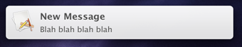

# NotificationDemo

I use this simple OS X application to test notification copy and configurations. Launches ```NSUserNotifications``` from a UI button and implements the ```NSUserNotificationCenterDelegate``` protocol.



### Apple Docs
* [NSUserNotification Class Reference](https://developer.apple.com/library/mac/documentation/Foundation/Reference/NSUserNotification_Class/Reference/Reference.html)
* [NSUserNotificationCenterDelegate Protocol Reference](https://developer.apple.com/library/mac/documentation/Foundation/Reference/NSUserNotificationCenterDelegate_Protocol/Reference/Reference.html)